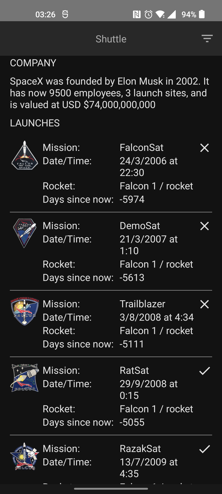

# Shuttle 🚀

Very simple demo project to showcase:

1. [Compose (testing)](https://developer.android.com/jetpack/compose?gclid=Cj0KCQjw852XBhC6ARIsAJsFPN1eTjqibEQfQK69pbQ74W48qZpeXr11vTlV4g5KlK411U09taGqDhYaAoB4EALw_wcB&gclsrc=aw.ds)
2. [Decompose](https://github.com/arkivanov/Decompose)
3. [MVIKotlin](https://github.com/arkivanov/MVIKotlin)
4. [KMP](https://kotlinlang.org/docs/multiplatform.html)
5. [SpaceX API](https://github.com/r-spacex/SpaceX-API)
6. [Koin](https://insert-koin.io/)
7. [Coroutines](https://github.com/Kotlin/kotlinx.coroutines)
8. [SQLDelight](https://cashapp.github.io/sqldelight/)
9. [Kotlinx.Serialization](https://github.com/Kotlin/kotlinx.serialization)
10. [Kotlinx.DateTime](https://github.com/Kotlin/kotlinx-datetime)
11. Kotlin Common testing
12. Compose testing

## What is Shuttle
The app is a very simple single screen app that just loads:
1. SpaceX company info
2. SpaceX Rocket launches

The purpose of the app is to play around with the SpaceX REST API and show case some of my learnings about other tools on Kotlin multiplatform and Android development.

//App screens

## Decisions
While developing the this tiny app I had to make some decisions that might make it different than yours:
1. The app is going to be kept the same size and I'm not planning to add more screens or features. This is allows me to iterate faster and try out some other ideas.
2. The libraries are carefully picked to allow sharing code with other platforms as much as possible through KMP.
3. Initially I started with 3 modules for the app
   A. Shared
   B. Compose-Shared  
   C. Android/Desktop app
4. After a bit of coding I realized having Compose-Shared, blocks the project from publishing quickly so I dropped it for now. Might come back to it again in future. So it's just Jetpack Compose for now.
5. I like "Feature modules", however, since this app only has one feature I really did not see the value of creating another module for the sake of having the module. Best part is, breaking it to smaller module and adding more feature modules is quite easy
6. As the side effect of using Decompose I get the device-rotation handling for free
7. As the side effect of using Compose I get dark-theme handling for free
8. I find this architecture super and easily testable, I have added some sample tests to some of the layers.
9. The entire launch JSON data of SpaceX API is not too much and can be loadded without pagination. so for the sake of caching and simplicity I disabled the pagination in the API and everything is loaded all at once.
10. On the other hand to reduce the total data loaded over network I "selected" the fields I really needed. (Many thanks to [SpaceX query options](https://github.com/r-spacex/SpaceX-API/blob/master/docs/queries.md))

## Contribution
All this is not to block you from contributing, feel free to post issues, PRs, even fork and copy for yourself.
Would love to see what you have in mind about this project.

|     | Main        | Filters | Social Links |
| --  | ----------- | --------| --           |
|Light| | | |
|Dark | | | |